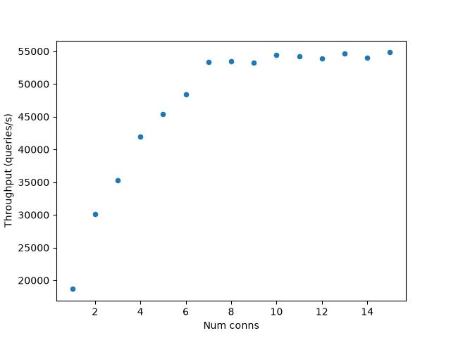

# Benchmarks

This directory contains the library's benchmarks.
This is a work in progress.

Frequently, I've found benchmarks that output a bunch of numbers
that look cool but end up translating into little useful information.
For nativepg, I'm trying a hypothesis-driven approach, where every benchmark
tries to answer a particular question.

The conclusions here have been extracted by running the benchmarks
on an i7-10510U 1.80GHz CPU with 4 cores/8 threads, under Ubuntu 24.04,
built with clang-20 and CMake 4.2.1 using the Release configuration.
All benchmarks use plaintext TCP.

For the server, I've got two setups:

- One running in localhost, using Docker (`postgres:17.4` image).
  This setup represents use cases where the network latency is small
  (e.g. where both client and server run in the same machine or
  availability zone). Caveat: client and server run in the same
  machine and may influence each other.
- One running in AWS, on a `t3.micro` EC2 instance with an Ubuntu 26.04 image.
  It uses the system's Postgres installation (v18.6).
  This setup represents use cases where network latency is large.
  A full network round-trip here takes around 100ms (observed with Wireshark).

## Are multiplexed connections worth it?

Tries to answer the question: are multiplexed connections faster
than dedicated connections?

Source: [`multiplexed_vs_dedicated.cpp`](multiplexed_vs_dedicated.cpp).

The workload is composed of simple SELECT queries (suitable for being
multiplexed), issued by a number of independent sessions running in
parallel. Both cases are given a single connection, shared by all
sessions:

- **Multiplexed**: sessions share a single `co_multiplexed_connection`.
- **Dedicated**: sessions share a single `co_connection`. Access is
  arbitrated using a `capy::async_mutex`.

Doing this measures connection utilization (i.e. given a fixed number
of connections, which case uses them more effectively?). This is
important because Postgres is one process per connection, so the max
number of connections is limited (usually `max_connections=100`).
Intuitively, multiplexed connections should be faster because they
pipeline concurrent requests, while dedicated connections keep
only one connection in-flight at any given time.

We measure latency, as seen by an individual session, and throughput,
as queries completed per unit of time.

**Discussion**: multiplexed is faster. The larger the network latency,
the more significant the improvement.

- For the localhost server, the multiplexed connection has around 20% more throughput.
  Wireshark reveals almost no coalescing of writes into fewer TCP segments.
  Speed likely comes from pipelining, rather than from write coalescing.
- For the AWS server, the multiplexed connection has 75x more throughput,
  with much more write coalescing than in the localhost case.
  Since we're running 100 sessions in parallel, this number indicates
  that we're pipelining as expected.

Follow-ups:

- We need to open more than one multiplexed connection to scale effectively,
  especially if the network latency is small. Boost.Redis' recommendation
  of one multiplexed connection per application does not transfer to us.
  This is because each Postgres connection is handled by one process
  using sync network calls, where Redis uses a single thread for all connections
  and non-blocking calls.
- We should measure whether coalescing writes is really worth the complexity.

## Does opening more than one multiplexed connection help scale?

Source: [`multiplexed_scaling.cpp`](multiplexed_scaling.cpp).

The workload is composed of simple SELECT queries (suitable for being
multiplexed), issued by a number of independent sessions running in
parallel. The sessions share a pool of multiplexed connections.
The benchmark varies the number of connections and records throughput.

Results for the localhost server:

The AWS server shows no performance improvement when increasing the number of connections.

**Conclusions**: opening more connections helps as long as server CPU
is the limiting factor.

- The localhost benchmark is CPU-bound. Throughput improves as the number of
  connections grows, up to 7 connections, where it flattens. The benchmark is
  run on a 4-core/8-thread machine, and the client code is single-threaded.
  This suggests CPU saturation, either client or server side.
  Qualitatively checking with `ps` reveals that it is the server processes that saturate the CPU.
  Because of Postgres' process-per-connection architecture, opening more
  connections improves performance until all CPUs are busy.
- The AWS benchmark is network-bound and shows no improvement.

Follow-ups:

- Connection pools need to take multiplexed connections into account.
  There should be an easy way for users to create several multiplexed connections
  and distribute their work among them. The optimal number depends on the server,
  but is likely much inferior than the default 100 connection limit.
